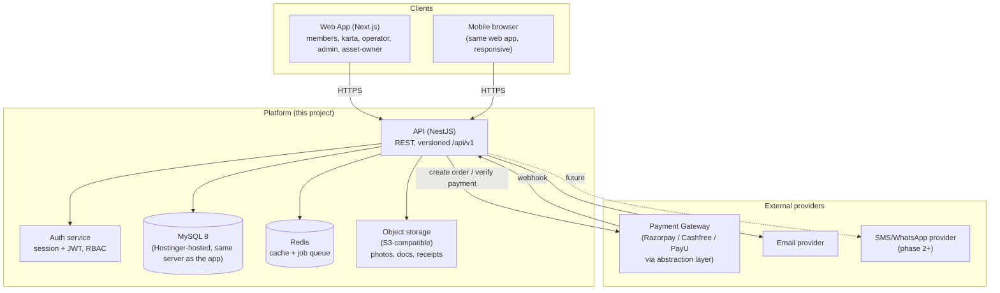
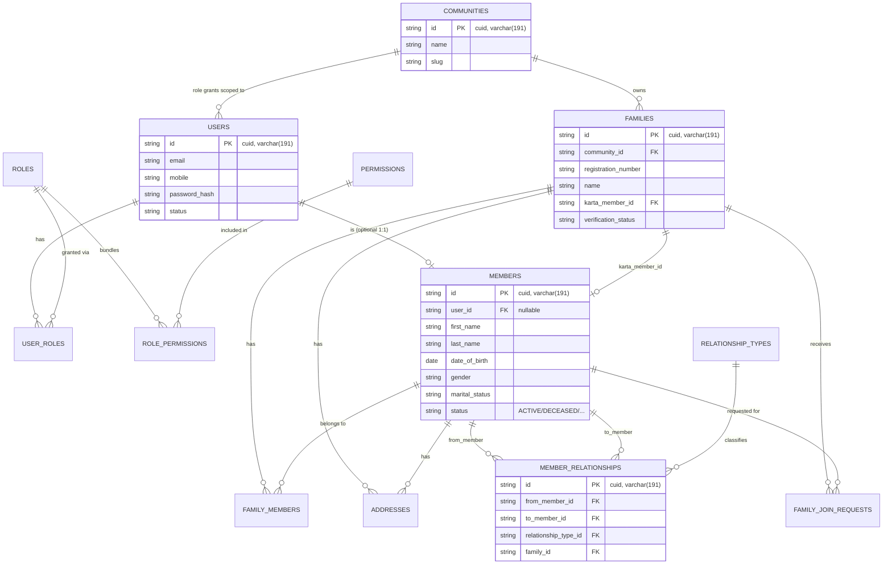
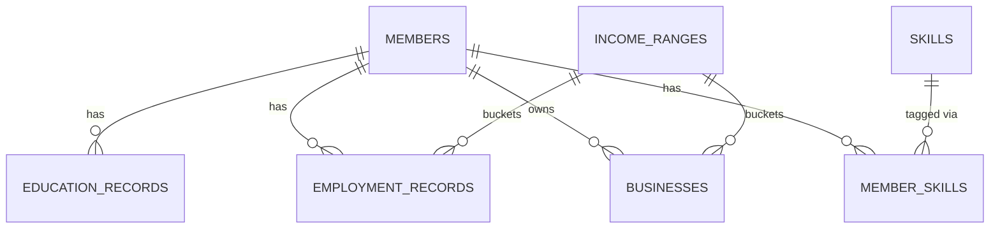
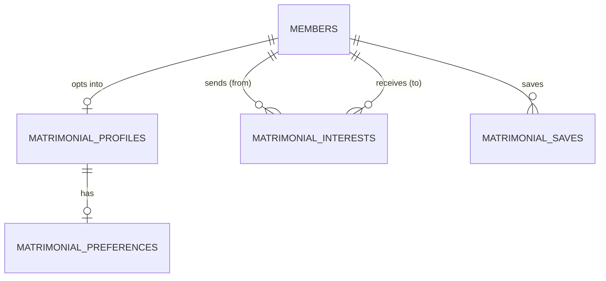
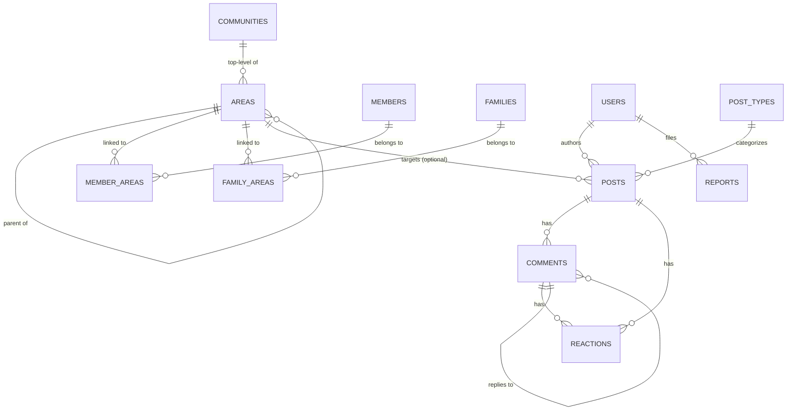
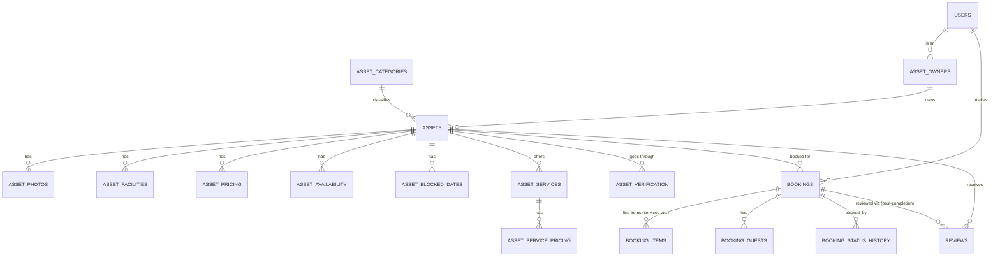
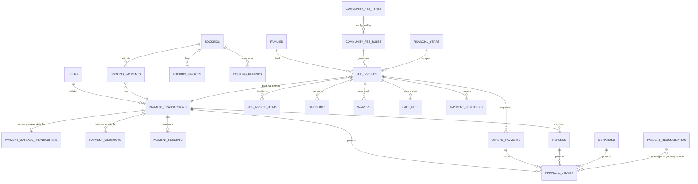
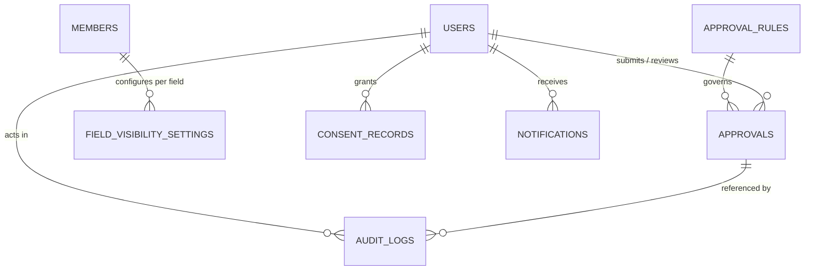
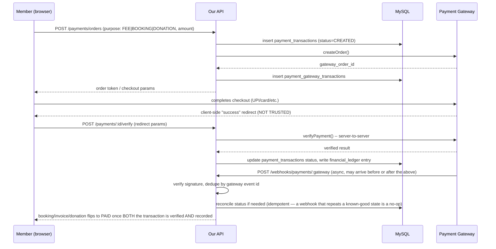

# Indian Community Platform — Phase 1: Requirements & Architecture

**Fresh build, replacing the current Ladwani/miladwani codebase in the same repo.** Database engine: **MySQL** (confirmed). Existing live data: **deleted at cutover**, not migrated (confirmed). This document is the complete Phase 1 deliverable — review it, then confirm before Phase 2 (detailed architecture) and any code/schema work begins.

## Contents

1. [Product Architecture](#phase-11--product-architecture)
2. [Complete Feature Map](#phase-12--complete-feature-map)
3. [Role & Permission Matrix](#phase-13--role--permission-matrix)
4. [User Journeys](#phase-14--user-journeys)
5. [Database ER Diagrams](#phase-15--database-er-diagrams)
6. [Database Schema (Entity Catalog)](#phase-16--database-schema-entity-catalog)
7. [API Architecture](#phase-17--api-architecture)
8. [Screen / Wireframe List](#phase-18--screen--wireframe-list)
9. [Privacy Architecture](#phase-19--privacy-architecture)
10. [Payment Architecture](#phase-110--payment-architecture)
11. [Booking Architecture](#phase-111--booking-architecture)
12. [Approval Workflow](#phase-112--approval-workflow)
13. [Development Roadmap](#phase-113--development-roadmap)

---

# Phase 1.1 — Product Architecture

## 1. Vision

A trusted digital home for one Indian community (architected to support many communities later) that unifies four things people currently manage across disconnected tools: **who is related to whom** (family registry + tree), **who's available to marry** (matrimony), **what's happening in the community** (social feed), and **how the community organization runs itself financially** (fees, donations, asset bookings, payments).

The system is trust-first: nothing about a person is visible by default beyond what they explicitly allow, every sensitive change is auditable, and money movement is never taken on faith from the browser.

## 2. Design Principles

1. **Community is the tenant boundary.** Every row of community-owned data (families, members, posts, assets, fees) hangs off a `community_id`. Day one ships with exactly one row in `communities`, but no table is designed assuming there's only ever one.
2. **Consent before publication.** A profile field being *filled in* is not the same as it being *visible*. Visibility is a first-class, per-field setting, not an afterthought bolted onto the UI.
3. **Relationships are data, not text.** Family structure is a graph (`member_relationships` edges with typed, invertible relationship types), so the tree is *derived*, never hand-drawn.
4. **Money is server-authoritative.** The browser can request a payment; only a verified webhook or a signed server-side confirmation can mark it paid. Nothing financial is ever deleted — corrections are new ledger entries, not edits.
5. **Nothing sensitive changes silently.** Marital status, death, karta transfer, relationship edits, asset approval, and offline-payment verification all pass through one shared approval engine, not one-off ad hoc checks scattered per feature.
6. **Built for 1M+ members from day one's schema**, even though day one's traffic won't need it — because retrofitting indexing/pagination into a live family-tree query engine is much more painful than designing for it up front.

## 3. System Context



## 4. Module Map

The platform is organized into 22 modules (matching the brief's final module list). Modules share the same auth, privacy, notification, audit, and payment substrate rather than reimplementing them.

| # | Module | Owns |
|---|---|---|
| 1 | Authentication & User Management | users, sessions, roles, permissions |
| 2 | Family Registry | families, family_members, addresses |
| 3 | Family Tree | member_relationships, tree rendering/query |
| 4 | Member Directory | member profile fields, search index |
| 5 | Community Social Network | posts, comments, reactions, reports |
| 6 | Area/Group Management | areas, member_areas, family_areas |
| 7 | Matrimony | matrimonial_profiles, preferences, interests |
| 8 | Community Services | asset_categories, asset facilities/photos |
| 9 | Asset Directory | assets, asset_owners, verification |
| 10 | Online Booking | bookings, booking_items, availability |
| 11 | Online Payment | payment_transactions, gateway abstraction |
| 12 | Community Family Fee Collection | fee_types, fee_rules, fee_invoices |
| 13 | Donations/Contributions | donation_causes, donations |
| 14 | Invoices & Receipts | fee_invoices, booking_invoices, receipts |
| 15 | Financial Ledger | financial_ledger (single source of financial truth) |
| 16 | Refunds & Reconciliation | refunds, payment_reconciliation |
| 17 | Notifications | notifications, notification_preferences |
| 18 | Approval Workflow | approvals, approval_rules |
| 19 | Privacy & Consent | field_visibility_settings, consent_records |
| 20 | Audit Log | audit_logs |
| 21 | Reporting | read-models/views over the above, no new writes |
| 22 | Administration | settings, admin config screens over 1–21 |

## 5. Multi-Community Readiness (day-one scope: single community)

- A `communities` table exists from day one (`id`, `name`, `slug`, `logo_url`, `settings JSON`, timestamps). Day one seeds exactly one row.
- `families`, `posts`, `assets`, `fee_types`, `areas` (top-level), and `users` (community-scoped role grants, not the user identity itself — a person could theoretically belong to more than one community later) all carry `community_id`.
- All list/search queries filter by `community_id` even when there's only one, so the day-two work to open a second community is "insert a row and point a subdomain at it," not "rewrite every query."
- Cross-community sharing (e.g. inter-community matrimony) is explicitly **out of scope** until requested — flagged here so it isn't silently assumed.

## 6. Non-Functional Requirements

| Concern | Target |
|---|---|
| Scale | 10,000 families / 100,000 members now; schema/indexing must not need a redesign at 1M members |
| Availability | Standard web-app SLA; no premature multi-region complexity |
| Response time | Search/list endpoints paginated, p95 < 500ms at target scale |
| Security | OWASP Top 10 mitigations, no plaintext secrets, no card data ever touches our servers |
| Privacy | Field-level visibility enforced at the query layer, not just hidden in the UI |
| Auditability | Every sensitive mutation is reconstructable from `audit_logs` |
| Financial integrity | Every rupee is traceable through `financial_ledger`; nothing financial is hard-deleted |

---

# Phase 1.2 — Complete Feature Map

Checklist form, organized by module. `[Auto]` = system-driven, no user action. `[Cfg]` = admin-configurable.

## 1. Authentication & User Management
- [ ] Register (mobile or email + password), mobile/email OTP verification
- [ ] Login (identifier + password), JWT access + refresh token, session revocation
- [ ] Password reset via OTP
- [ ] Account deactivation (self-service) and deletion request (routed to admin)
- [ ] Role assignment (Admin only), multiple roles per user supported
- [ ] Permission checks centralized in one guard/decorator, not duplicated per route

## 2. Family Registry
- [ ] Register new family (goes to Operator/Admin verification queue)
- [ ] Request to join an existing family (routed to Karta for approval)
- [ ] Karta: edit family info (name, native place, Kuladevata/Gotra, address, photo)
- [ ] Karta: add member (new person) or link existing platform member (with that member's approval)
- [ ] Karta: remove member (soft-remove with reason), change member status
- [ ] Karta transfer (Admin-approved action, not self-service)
- [ ] Duplicate-family detection at registration `[Auto]`

## 3. Family Tree
- [ ] Auto-generated tree from `member_relationships`, not manually drawn
- [ ] Zoom / pan / expand-collapse / search-within-tree
- [ ] Visual states: living/deceased, married/unmarried
- [ ] Open member profile from a tree node
- [ ] Print / download (PDF or image export)
- [ ] Privacy-filtered: a viewer only sees nodes/fields they're allowed to see

## 4. Member Directory
- [ ] Structured profile: identity, contact, residence (current + native), marital status, education, skills, employment/business, income range, bio
- [ ] Profile photo + additional photos
- [ ] Multi-field search (name, family, member ID, area, city, state, native place, education, occupation, skills, marital status, age range, gender, matrimony availability)
- [ ] Paginated, indexed search — never a full table scan client-side

## 5. Community Social Network
- [ ] Post categories: general, announcement, event, matrimonial, achievement, birthday, marriage, condolence, job, business, service, lost & found, other `[Cfg]`
- [ ] Create post (text + photos), comment, react, report
- [ ] Feed ranking: My Area → City → Community → announcements → events → relevant members → matrimony
- [ ] Feed filters: My Area / City / Community
- [ ] Operator/Admin moderation queue for reported content

## 6. Area/Group Management
- [ ] Hierarchical areas: Country → State → District → City → Area → Local Group
- [ ] Member/family can belong to more than one area
- [ ] Admin CRUD on area tree `[Cfg]`

## 7. Matrimony
- [ ] Opt-in only — profile never auto-created from the base member profile
- [ ] Profile fields: photo, age (derived), education, occupation, skills, city, native place, family background, about, partner preferences
- [ ] Actions: Send Interest, Request Contact, Contact Family, Save Profile, Report
- [ ] Contact details never shown by default; reveal only per configured policy (accept-first or family-approval)
- [ ] Search filters: age, gender, location, native place, education, profession, income range, marital status, skills, subgroup

## 8–9. Community Services & Asset Directory
- [ ] Asset categories: accommodation (hotel/hostel/guest house/dormitory), events (marriage hall/banquet/function hall/community hall/conference room), extensible for future categories `[Cfg]`
- [ ] Asset Owner registers asset: description, address, map location, photos/videos, facilities, capacity, pricing, policies
- [ ] Verification workflow: Pending → Under Verification → Approved/Rejected/Suspended/Temporarily Unavailable/Closed
- [ ] "Verified Community Asset" badge on approved assets
- [ ] Search by category, city, area, distance, date, capacity, price, facilities, rating, verified status

## 10. Online Booking
- [ ] Booking flow: select asset → date/time → duration/rooms/people → additional services → price calc → confirm → pay or request → confirmation
- [ ] Instant booking (available slot → pay → auto-confirm) vs. request booking (owner approval → pay → confirm)
- [ ] Availability calendar: available/reserved/pending/blocked/maintenance/holiday
- [ ] Owner can block dates
- [ ] Double-booking prevented at the DB layer (not just UI validation)
- [ ] Additional services selectable at booking time (catering, decoration, DJ, photography, etc.) `[Cfg]`
- [ ] QR booking confirmation code, scannable by asset staff for on-site verification (minimal info exposed)
- [ ] Cancellation with configurable deadline/refund-percentage/charges `[Cfg]`
- [ ] Reviews after completed, verified bookings only

## 11. Online Payment
- [ ] Gateway abstraction (Razorpay/Cashfree/PayU pluggable, not hardcoded)
- [ ] UPI, cards, net banking, wallets — whatever the active gateway supports
- [ ] Server-side payment verification; webhook signature verification; idempotent webhook handling
- [ ] Full / advance / partial / milestone payment support
- [ ] Payment statuses: created, pending, initiated, processing, successful, failed, cancelled, refunded, partially refunded, under verification

## 12. Community Family Fee Collection
- [ ] Fee types: registration, annual, monthly/quarterly/half-yearly, lifetime, event, special, other `[Cfg]`
- [ ] Fee rules: amount, frequency, effective date, applicable families/areas/member category, discounts, late fee, grace period, due date, financial year `[Cfg]`
- [ ] Karta: view outstanding, pay now, view history, download receipts
- [ ] Automated reminders at 30/7/0/overdue days, in-app + email now, SMS/WhatsApp later
- [ ] Offline payments (cash/bank transfer/cheque) — pending verification, an Operator/Admin (never the payer) confirms

## 13. Donations/Contributions
- [ ] Separately categorized from mandatory fees, both in UI and in the ledger
- [ ] Configurable causes (community development, education, medical, events, charity, emergency) `[Cfg]`

## 14. Invoices & Receipts
- [ ] Auto-generated receipt on successful payment (community name/logo, receipt #, family, fee type, financial year, amount, method, transaction ref)
- [ ] Download / print / email
- [ ] Invoice generation where applicable (e.g. asset bookings with tax lines)

## 15. Financial Ledger
- [ ] Single ledger table every financial event writes to, regardless of source (fee, booking, donation, refund)
- [ ] Never edited in place — corrections are new reversal/adjustment entries

## 16. Refunds & Reconciliation
- [ ] Refunds tracked end-to-end and, where applicable, processed via the gateway
- [ ] Admin reconciliation view: gateway records vs. internal records, flags missing/duplicate/mismatched amounts

## 17. Notifications
- [ ] In-app (Phase 1), email (Phase 1), SMS/WhatsApp (designed for, wired later)
- [ ] Event-driven: approval outcomes, matrimonial interest, announcements, fee reminders, payment/booking/refund events

## 18. Approval Workflow
- [ ] One generic engine: Draft → Submitted → Under Review → Approved / Rejected / Returned
- [ ] Configurable per action type (`approval_rules`): which role approves, whether approval is required at all

## 19. Privacy & Consent
- [ ] Per-field visibility: Public / Registered Community / Same Area / Same Family / Matrimony Only / Admin-Operator / Private
- [ ] Consent records for profile, family info, photos, matrimony visibility, directory listing, notifications
- [ ] Self-service data access, correction, deactivation, deletion request

## 20. Audit Log
- [ ] Every sensitive mutation logged: actor, role, action, entity, field, before/after, timestamp, related approval

## 21. Reporting
- [ ] Family/member demographics, matrimony pipeline, service/asset utilization, financial (billed/collected/outstanding/overdue/donations, by area/month/year)
- [ ] Authorized CSV/Excel export

## 22. Administration
- [ ] Config surfaces for: roles/permissions, relationship types, member statuses, education levels, occupations, skills, areas, post types, privacy defaults, matrimony fields, asset categories/facilities, booking rules, payment gateway selection, fee types/rules, financial years, discounts/waivers/late fees, notification rules

---

# Phase 1.3 — Role & Permission Matrix

## 1. Model

RBAC with a granular permission layer underneath — roles are just named bundles of permissions, and Admin can edit those bundles (section 85) without a code change. A user can hold more than one role (e.g. Karta + Asset Owner).

```
users ──< user_roles >── roles ──< role_permissions >── permissions
```

- `roles`: MEMBER, KARTA, OPERATOR, ASSET_OWNER, ADMIN (seeded, `is_system = true` so they can't be deleted, but their permission bundle *can* be edited).
- `permissions`: `resource:action` strings, e.g. `family:create`, `family:edit:own`, `member:edit:any`, `asset:approve`, `fee:configure`.
- Scope qualifiers (`:own`, `:family`, `:any`) are part of the permission string itself, checked against the resource's actual owner/family at request time — not just "does this role have this permission" but "does this role have this permission *for this specific record*."

## 2. Permission Catalog (representative, not exhaustive — Phase 4 finalizes the full list)

| Permission | Meaning |
|---|---|
| `profile:edit:own` | Edit your own member profile |
| `profile:edit:any` | Edit any member's profile (Admin escape hatch) |
| `family:create` | Register a new family |
| `family:edit:own` | Karta edits their own family's record |
| `family:member:add` | Add a member to a family (new or link-existing) |
| `family:member:remove` | Remove a member from a family |
| `family:karta:transfer` | Change who the Karta is (Admin-approved) |
| `matrimony:manage:own` | Create/edit own matrimonial profile |
| `matrimony:manage:family` | Karta manages a family member's matrimonial profile, where that member has delegated it |
| `post:create` | Create a community post `[Cfg per role]` |
| `moderation:review` | Review reported content |
| `asset:register` | Submit a new asset for approval |
| `asset:approve` | Approve/reject a submitted asset |
| `asset:manage:own` | Manage an asset you own |
| `booking:create` | Book an asset |
| `booking:manage:own` | Owner manages bookings on their asset |
| `fee:configure` | Create/edit fee types and rules |
| `fee:pay:family` | Karta pays on behalf of their family |
| `payment:verify:offline` | Confirm an offline payment (never the payer themself) |
| `refund:approve` | Approve a refund |
| `role:manage` | Assign/revoke roles |
| `audit:view` | View audit logs (scope varies: own area for Operator, everything for Admin) |

## 3. Permission Matrix (from the brief, formalized)

`Yes*` = granted by default but the specific scope/limit is Admin-configurable. `Req` = the actor can request the action but a higher role must approve.

| Function | Member | Karta | Operator | Asset Owner | Admin |
|---|---|---|---|---|---|
| View own profile | Yes | Yes | Yes | Yes | Yes |
| Edit own profile | Yes | Yes | Yes | Yes | Yes |
| Add family member | No | Yes | Yes* | No | Yes |
| Edit family | No | Yes | Yes* | No | Yes |
| Remove family member | No | Yes | Yes* | No | Yes |
| Transfer Karta | Req | Req | No | No | Yes |
| Search members | Yes | Yes | Yes | Yes | Yes |
| Matrimony (own profile) | Yes | Yes | Yes | Yes | Yes |
| Manage family member's matrimony | No | Yes* | No | No | Yes |
| Create posts | Yes* | Yes | Yes | Yes* | Yes |
| Moderate posts | No | No | Yes | No | Yes |
| Register asset | Req | Req | Yes | Yes | Yes |
| Approve asset | No | No | Yes* | No | Yes |
| Manage asset | No | No | Limited | Yes (own) | Yes |
| Book asset | Yes | Yes | Yes | Yes | Yes |
| Pay family fee | No | Yes | Authorized | Authorized | Yes |
| View family payments | No | Yes | Limited | No | Yes |
| Configure fees | No | No | No | No | Yes |
| Verify offline payment | No | No | Authorized | No | Yes |
| Refund | Req | Req | No | Req | Yes |
| Manage roles | No | No | No | No | Yes |
| View audit logs | No | Limited (own family) | Limited (own area) | Limited (own assets) | Yes |

## 4. Hard Rules (never bypassed by role)

- A member can never edit another member's profile directly — only propose a change that the target approves, or that goes through the approval engine if the target can't/won't respond (e.g. marking someone deceased).
- Karta authority stops at "manage family structure" — it does not extend to overriding an adult member's own sensitive personal data (contact info, matrimony visibility, income) without that member's consent.
- Asset Owner scope is strictly their own assets; there is no implicit escalation to Operator/Admin capability.
- Only Admin can configure fees, gateways, or roles/permissions themselves.

---

# Phase 1.4 — User Journeys

Each journey names its trigger, steps, decision points, and what the approval/notification system does along the way.

## J1 — Registration & Family Onboarding

1. User registers (mobile or email + password) → OTP verification.
2. System asks: *"Are you joining an existing family, or registering a new one?"*
3a. **Existing family**: search by family name/registration number → "Request to Join" → request routed to that family's Karta → Karta approves/declines → on approval, `family_members` row created, relationship captured.
3b. **New family**: fill preliminary family record → duplicate-check runs (name + native place + similar member names) → if a possible match is found, show *"Possible duplicate found"* and let the user either continue or switch to 3a → submission enters Operator verification queue → Operator/Admin verifies → family activated, submitter becomes provisional Karta.
4. Either path ends with the member `ACTIVE` and able to use the rest of the platform; family-linkage state (`PENDING`/`ACTIVE`) is visible on their dashboard the whole time.

## J2 — Karta Adds a Family Member

1. Karta opens **My Family → Add Member**.
2. Choose: *brand-new person* (not on the platform) vs. *existing platform member*.
3a. **New person**: fill profile fields, set relationship to an existing family member → member created directly, both directions of the relationship written (e.g. Son ↔ Father) via the relationship type's configured inverse.
3b. **Existing member**: search platform → select → set relationship → request sent to *that person* (not the Karta) for approval, since the person already has their own account and consent matters → on approval, same relationship-write as 3a.
4. Duplicate-check runs before either path commits.

## J3 — Marriage / Spouse Linking

1. Karta or the member themself opens **Update Marital Status → Married**.
2. Choose: existing community member as spouse / add spouse as new member / record as non-community spouse (name/details only, no login).
3. System creates the Husband↔Wife relationship pair (or a one-directional record for a non-community spouse) and updates `marital_status` — original family-of-birth relationships are never removed.
4. Sensitive-change approval rule fires (`member.marital_status.change` → Operator review) unless the community's approval config says otherwise for self-reported status changes.

## J4 — Marking a Member Deceased

1. Karta or Admin opens the member record → **Mark as Deceased**.
2. Enter date/place/age-at-death, optional memorial note and photo.
3. This is an approval-gated action (`member.mark_deceased` → Operator/Admin) — never a same-click status flip, given the sensitivity and irreversibility.
4. On approval: `status = DECEASED`. Record is never deleted; it remains in the tree subject to the same privacy rules as before (a viewer who couldn't see the field before still can't see it after).

## J5 — Matrimony Discovery & Interest

1. Member opts in, fills a matrimonial profile (separate from — but sourced from — their base profile) and sets partner preferences.
2. Other members search/filter (age, location, education, profession, income range, etc.) and only see fields the profile owner has made Matrimony-visible.
3. Viewer sends **Interest**, or **Requests Contact**, or **Contacts Family** (whichever the profile owner has enabled).
4. Profile owner is notified, approves/declines. Contact details are revealed only per the community's configured policy (accept-first vs. family-approval) — never automatically on interest alone.

## J6 — Asset Discovery & Booking (Instant)

1. Member browses/searches Community Services (category, city, date, capacity, price, verified-only).
2. Opens asset detail → checks live availability calendar → selects date/time, add-on services → sees computed price (base + seasonal + add-ons + tax − community discount).
3. Confirms → pays → **server verifies payment** → booking flips to `CONFIRMED` only after verification succeeds (never on the browser's say-so) → confirmation + QR code issued, notifications sent to member and asset owner.

## J7 — Asset Booking (Request-based)

1. Same discovery/selection steps as J6, but the asset requires owner approval (e.g. a large hall).
2. Booking enters `REQUESTED` → owner approves/declines within a configured window.
3. On approval, member is prompted to pay → same server-verified payment step as J6 → `CONFIRMED`.
4. If the owner doesn't respond in time or declines, the request auto-expires/cancels and the held slot is released.

## J8 — Family Fee Payment

1. Karta opens **Community Fees**, sees outstanding items (billed/paid/outstanding, due date, late fee if overdue).
2. **Pay Now** → choose method → gateway checkout → **server-side verification** of the payment → invoice marked paid, receipt generated, ledger entry written, reminder schedule for that invoice cancelled, notification sent.
3. If payment fails or the browser closes mid-flow, the invoice stays outstanding and a reconciliation job later checks the gateway's own record of that order to catch a "paid but not confirmed" edge case.

## J9 — Offline Payment Verification

1. Karta records an offline payment (cash/bank transfer/cheque) against an invoice, attaching a reference/receipt if available.
2. Status: `PENDING_VERIFICATION` — invisible as "paid" to anyone but the Karta and staff until acted on.
3. An Operator/Admin (never the payer) verifies it → status `VERIFIED` → receipt generated, ledger entry written.

## J10 — Approval Queue (Operator/Admin)

1. Operator opens their queue (scoped to their assigned area where applicable): pending families, member changes, relationship edits, marital/deceased status changes, asset submissions, offline payments.
2. Each item shows the proposed change, the submitter, and (where relevant) the duplicate-check result.
3. Approve / Reject / Return-for-correction, with a required reason for reject/return.
4. Action is logged to `audit_logs` and the submitter is notified either way.

## J11 — Duplicate Detection & Merge Review

1. Triggered automatically during family/member creation (name + DOB + mobile + native place + parent/spouse overlap heuristics).
2. Possible matches surfaced to the submitter *and* flagged for Operator/Admin review regardless of what the submitter chooses.
3. Operator/Admin can review both records side-by-side and merge — but the system never auto-merges; a human always confirms which record wins and what happens to the other.

---

# Phase 1.5 — Database ER Diagrams

Split into domain-focused diagrams rather than one unreadable mega-diagram. Full column lists live in `06-database-schema.md`; these show cardinality and the shape of each domain.

## 5.1 Identity, Family & Tree



## 5.2 Education, Employment, Skills, Income



## 5.3 Matrimony



## 5.4 Community Social Network & Areas



## 5.5 Community Services, Assets & Booking



## 5.6 Payments, Fees & Financial Ledger



## 5.7 Approval, Privacy & Audit (cross-cutting)



---

# Phase 1.6 — Database Schema (Entity Catalog)

**Engine: MySQL 8** (Hostinger-hosted, same server as the app — see `13-development-roadmap.md` for why). This is the **logical schema catalog** for sign-off: every table, its purpose, and its key/distinguishing fields. Full DDL, exact column types, indexes, and migration files are the concrete output of **Phase 4 — Database**, not duplicated here. All tables include `id (string, pk — app-generated cuid, stored as varchar(191))`, `created_at`, `updated_at` unless noted; mutable community-owned records also carry `created_by`/`updated_by`. Nothing described as "soft delete" is ever hard-deleted. Structured/nested fields (`jsonb` in a Postgres-native design) are `JSON` columns — MySQL 8's native JSON type — noted as `jsonb` in table cells below only because that's the more universally-recognized shorthand for "structured JSON blob column"; the actual column type is MySQL's `JSON`.

Conventions: `FK→table` = foreign key. `[soft-delete]` = has `deleted_at`. `[audit]` = mutations to this table are expected to also write an `audit_logs` row.

## A. Identity & Access

| Table | Purpose | Key fields |
|---|---|---|
| `communities` | Tenant boundary (one row today) | name, slug, logo_url, settings jsonb |
| `users` | Login identity | email, mobile, password_hash, status (PENDING/ACTIVE/SUSPENDED/BLOCKED/DEACTIVATED), email_verified, mobile_verified, last_login_at, failed_attempts, locked_until `[soft-delete]` |
| `roles` | MEMBER/KARTA/OPERATOR/ASSET_OWNER/ADMIN, admin-editable | code, label, is_system |
| `permissions` | Granular `resource:action` strings | code, label, module |
| `user_roles` | User↔role, scoped optionally to a family/area | user_id FK→users, role_id FK→roles, family_id FK→families (nullable), area_id FK→areas (nullable) |
| `role_permissions` | Role↔permission bundle | role_id, permission_id |
| `refresh_tokens` | Session/refresh token store | user_id, token_hash, device_info, expires_at, revoked_at |
| `verification_tokens` | OTP/email-verify tokens | user_id, type, token_hash, expires_at, used_at |
| `consent_records` | Explicit consent trail | user_id, consent_type, granted, version, ip_address |

## B. Family Registry & Tree

| Table | Purpose | Key fields |
|---|---|---|
| `families` `[audit][soft-delete]` | The family unit | community_id, registration_number (unique), name, surname, karta_member_id FK→members, kuladevata, kuladevi, gotra, native_village/district/state/country, verification_status, status |
| `members` `[audit][soft-delete]` | A person (may or may not have a login) | user_id FK→users (nullable), first/middle/last_name, gender, date_of_birth, marital_status, status (ACTIVE/INACTIVE/DECEASED/SUSPENDED), deceased_at/place/notes, profile_photo_id |
| `family_members` | Family↔member membership, with history | family_id, member_id, is_karta, joined_at, joined_by, left_at, left_reason (unique on family_id+member_id while active) |
| `family_join_requests` | Consent gate for linking an existing member into a family, from either direction (Karta-invites or member-requests) | family_id, member_id, related_to_member_id, relationship_type_code, requested_by, status (PENDING/APPROVED/DECLINED) |
| `relationship_types` | Configurable relationship vocabulary | code (unique), label, inverse_code, gender_applicable, is_spouse, sort_order |
| `member_relationships` | The graph edges the tree is built from | from_member_id, to_member_id, relationship_type_id, family_id, is_active |
| `marital_status_history` | Every status transition, not just current | member_id, status, effective_date, changed_by, approval_id |
| `marriage_records` | Marriage-specific facts (may reference a non-community spouse) | member_id_1, member_id_2 (nullable), external_spouse_name/info, marriage_date, status |
| `addresses` | Current + native addresses for a family or member | addressable_type, family_id (nullable FK), member_id (nullable FK) — **two nullable FKs, not one polymorphic column**, address_type, line1/2, city/district/state/pincode, is_primary |

## C. Education, Employment, Skills, Income

| Table | Purpose | Key fields |
|---|---|---|
| `education_records` | One member, many entries | member_id, level, qualification, specialization, institution, year_completed, is_highest |
| `employment_records` | Job history | member_id, employment_type, employer_name, designation, industry, income_range_id, is_current |
| `businesses` | Business ownership | member_id, business_name, business_type, industry, income_range_id, is_active |
| `skills` | Admin-managed skill catalog | name (unique), category |
| `member_skills` | Member↔skill, with level | member_id, skill_id, level |
| `income_ranges` | Configurable buckets, never exact salary | label, min_value, max_value, sort_order |

## D. Matrimony

| Table | Purpose | Key fields |
|---|---|---|
| `matrimonial_profiles` | Opt-in extension of a member profile | member_id (unique), is_visible, about, height_cm, languages jsonb |
| `matrimonial_preferences` | Partner preferences | matrimonial_profile_id (unique), min/max_age, preferred_gender, preferred_locations jsonb, education/occupation preference, income_range_id |
| `matrimonial_interests` | Send Interest / Request Contact | from_member_id, to_member_id, message, status (PENDING/ACCEPTED/DECLINED/WITHDRAWN) |
| `matrimonial_saves` | Save-for-later | member_id, saved_member_id |

## E. Community Social Network & Areas

| Table | Purpose | Key fields |
|---|---|---|
| `areas` | Country→State→District→City→Area→Group hierarchy | community_id, parent_id (self FK), name, type, code |
| `member_areas` / `family_areas` | Many-to-many area membership | member_id/family_id, area_id, is_primary |
| `post_types` | Configurable post categories | code, label, icon, requires_approval |
| `posts` `[soft-delete]` | Community feed content | author_id, post_type_id, title, content, visibility, target_area_id, status, is_pinned |
| `comments` `[soft-delete]` | Threaded replies | post_id, author_id, parent_id (self FK), content |
| `reactions` | Like/love/etc. on a post **or** comment | post_id (nullable FK), comment_id (nullable FK) — again, two nullable FKs rather than one polymorphic column, unique per (post_id, user_id) and (comment_id, user_id) | 
| `reports` | User-filed content/user reports | reportable_type, reportable_id, reporter_id, reason, status |

## F. Community Services, Assets & Booking

| Table | Purpose | Key fields |
|---|---|---|
| `asset_categories` | Extensible category tree (accommodation, events, future: caterers, photographers, etc.) | code, label, parent_id |
| `asset_owners` | Owner/service-provider profile | user_id (unique), business_name, verified_at |
| `assets` `[audit][soft-delete]` | The bookable thing | asset_owner_id, category_id, name, description, address/city/district/state/pincode, geo_lat/lng, area_id, capacity, status |
| `asset_photos` / `asset_documents` | Media & compliance docs | asset_id, url, sort_order |
| `asset_facilities` | Facility tags (parking, AC, catering-allowed, etc.) | asset_id, facility_code |
| `asset_pricing` | Base/seasonal/weekend/community-member pricing | asset_id, price_type, amount, valid_from/to |
| `asset_availability` | Materialized per-date/slot availability | asset_id, date, slot, status (AVAILABLE/RESERVED/PENDING/BLOCKED/MAINTENANCE/HOLIDAY) — **unique (asset_id, date, slot)**, this is the row a booking transaction locks |
| `asset_blocked_dates` | Owner-initiated blocks | asset_id, date_from, date_to, reason |
| `asset_services` | Add-on services offered by an asset | asset_id, code, label |
| `asset_service_pricing` | Pricing for an add-on | asset_service_id, amount, unit |
| `asset_verification` | The approval-workflow instance for an asset | asset_id, status, submitted_by, reviewed_by, notes |
| `bookings` `[audit]` | A confirmed-or-in-progress reservation | asset_id, user_id, status (REQUESTED/CONFIRMED/CANCELLED/COMPLETED/EXPIRED), booking_type (INSTANT/REQUEST), date_from/to, total_amount |
| `booking_items` | Line items: base rate + selected services | booking_id, item_type, description, quantity, unit_price |
| `booking_guests` | Minimal guest/attendee info where relevant | booking_id, name, contact |
| `booking_status_history` | Every status transition | booking_id, from_status, to_status, changed_by, reason |
| `reviews` / `ratings` | Post-completion feedback, gated on a completed booking | booking_id (unique per reviewer), asset_id, overall/cleanliness/facilities/service/value/location scores, comment |
| `asset_reports` | Reports against an asset (distinct from generic content reports) | asset_id, reporter_id, reason |

## G. Payments

| Table | Purpose | Key fields |
|---|---|---|
| `payment_methods` | Enabled methods per gateway | gateway_code, method_code (UPI/CARD/NETBANKING/WALLET), is_active |
| `payment_transactions` | **The single row every payment flow (fee, booking, donation) creates one of** | user_id, purpose_type (FEE/BOOKING/DONATION), purpose_id, gateway_code, amount, currency, status |
| `payment_gateway_transactions` | Raw gateway-side state, 1:1 with the above | payment_transaction_id, gateway_order_id, gateway_payment_id, gateway_signature, raw_response jsonb |
| `payment_webhooks` | Every inbound webhook, verified or not, for replay/audit | payment_transaction_id (nullable until matched), event_type, signature_valid, payload jsonb, received_at |
| `payment_receipts` | Generated receipt artifact | payment_transaction_id, receipt_number (unique), pdf_url |
| `refunds` | Refund against a transaction | payment_transaction_id, amount, reason, status, gateway_refund_id |
| `booking_payments` | Ties a booking to one or more payment_transactions (advance + balance) | booking_id, payment_transaction_id, payment_stage (ADVANCE/BALANCE/FULL) |
| `booking_invoices` | Tax invoice for a booking | booking_id, invoice_number, tax_amount, total_amount |
| `booking_refunds` | Cancellation refund detail for a booking | booking_id, refund_id FK→refunds, cancellation_charge |

## H. Community Fees & Donations

| Table | Purpose | Key fields |
|---|---|---|
| `financial_years` | e.g. "2026-27" | label (unique), start_date, end_date |
| `community_fee_types` | Registration/annual/monthly/event/etc. | code, label, default_amount, frequency |
| `community_fee_rules` | Amount + applicability for a fee type in a financial year | fee_type_id, financial_year_id, amount, applicable_area_id/family_category, late_fee_config jsonb, grace_period_days |
| `family_fee_assignments` / `member_fee_assignments` | Which fee rule applies to which family/member | family_id or member_id, fee_rule_id, effective_date |
| `fee_invoices` `[audit]` | A billed amount for a family, one financial year | family_id, fee_rule_id, financial_year_id, amount_billed, amount_paid, status (UNPAID/PARTIAL/PAID/OVERDUE/WAIVED), due_date |
| `fee_invoice_items` | Line items (base amount, late fee, discount as negative line) | fee_invoice_id, description, amount |
| `discounts` / `waivers` | Applied reductions, always with a reason | fee_invoice_id, type, original_amount, reduction_amount, reason, approved_by |
| `late_fees` | Accrued late-fee records | fee_invoice_id, amount, accrued_on |
| `payment_reminders` | Scheduled/sent reminder log | fee_invoice_id, channel, scheduled_for, sent_at |
| `offline_payments` `[audit]` | Cash/bank/cheque payment pending human verification | fee_invoice_id, amount, method, reference, status (PENDING_VERIFICATION/VERIFIED), verified_by |
| `donation_causes` | Configurable donation causes | code, label, is_active |
| `donations` | A donation, always distinct from a mandatory fee | donor_user_id, cause_id, amount, payment_transaction_id |
| `financial_ledger` | **The append-only source of truth for every rupee** | entry_type (FEE/BOOKING/DONATION/REFUND/ADJUSTMENT), family_id, member_id, booking_id, invoice_id, payment_transaction_id, amount, tax, discount, net_amount, financial_year_id, created_by, verified_by |
| `payment_reconciliation` | Reconciliation run output | run_date, gateway_code, mismatches jsonb, resolved_by |

## I. Approval, Privacy, Notifications, Audit

| Table | Purpose | Key fields |
|---|---|---|
| `approval_rules` | Which action codes require approval and by whom | action_code (unique), requires_approval, approver_role, auto_approve_role |
| `approvals` | An in-flight or resolved approval instance | action_code, entity_type, entity_id, field_name, old_value/new_value jsonb, status, submitted_by, reviewed_by, reason |
| `audit_logs` | Immutable action trail | actor_id, actor_role, action, entity_type, entity_id, field_name, old_value/new_value jsonb, approval_id, ip_address |
| `field_visibility_settings` | Per-member, per-field visibility override (defaults come from `field_visibility_defaults`) | member_id, field_name, visibility (PUBLIC/COMMUNITY/AREA/FAMILY/MATRIMONY/ADMIN/PRIVATE) |
| `field_visibility_defaults` | Community-wide default per field | field_name (unique), default_visibility, is_user_configurable |
| `notifications` | In-app notification feed | recipient_id, sender_id, type, title, body, data jsonb, is_read, email_sent, sms_sent |
| `reports` | (see section E — shared table for post/comment/member/asset reports via `reportable_type`) | |
| `settings` | Free-form community config | key (unique), value jsonb, description |

## J. Polymorphism Policy

Several tables above (`addresses`, `reactions`, future `photos`) hold data that conceptually attaches to more than one parent type (a family *or* a member; a post *or* a comment). Every one of them uses **separate nullable foreign-key columns per target type** with real referential-integrity constraints — never a single shared "any-table" id column. A single shared id column can't carry a real foreign-key constraint in MySQL (or any relational database) since a physical FK constraint is inherently table-and-column specific — this exact mistake in the previous Ladwani project's schema broke Prisma's own constraint-naming validation before it ever reached a real database. Building it correctly from the start avoids a class of bug that would otherwise surface only once real data volume made it expensive to fix.

---

# Phase 1.7 — API Architecture

## 1. Style & Conventions

- REST, versioned base path `/api/v1`.
- NestJS modules mirror the 22 product modules (one Nest module per module, each with its own controller/service/DTOs) — the API's folder structure should make it obvious where a given feature lives without cross-referencing this doc.
- Auth: `Authorization: Bearer <JWT>` (access token, short-lived) + refresh-token rotation endpoint. Session/cookie-based auth for the web app's own first-party calls, JWT for anything else (mobile app later, integrations).
- Pagination: `?page=&limit=` everywhere a list is returned, response envelope `{ data, meta: { page, limit, total } }` — never an unbounded array.
- Filtering: consistent `?filter[field]=value` style across list endpoints rather than ad hoc query param names per module.
- Errors: RFC7807-style problem responses (`{ statusCode, error, message, details? }`), consistent across every module — a client should never need module-specific error parsing.
- Idempotency: any endpoint that creates a financial side effect (payment order creation, refund) requires an `Idempotency-Key` header.

## 2. Resource Map (representative — full OpenAPI spec is a Phase 5 deliverable)

### Auth
```
POST   /auth/register
POST   /auth/verify-otp
POST   /auth/login
POST   /auth/refresh
POST   /auth/logout
POST   /auth/forgot-password
POST   /auth/reset-password
```

### Users & Roles (Admin)
```
GET    /users
GET    /users/:id
PATCH  /users/:id/status
POST   /users/:id/roles
DELETE /users/:id/roles/:roleId
```

### Family Registry
```
POST   /families
GET    /families/:id
PATCH  /families/:id
GET    /families/:id/members
POST   /families/:id/members            (add new member)
POST   /families/:id/join-requests      (Karta invites an existing member)
POST   /join-requests                   (self-service: member requests to join)
POST   /join-requests/:id/respond
PATCH  /families/:id/members/:memberId  (status change)
DELETE /families/:id/members/:memberId  (remove, soft)
```

### Family Tree
```
GET    /families/:id/tree               (privacy-filtered graph, ready to render)
GET    /families/:id/tree/export        (PDF/image)
```

### Member Directory
```
GET    /members/search?...filters
GET    /members/:id
PATCH  /members/:id                     (own profile only, enforced server-side)
POST   /members/:id/photos
```

### Matrimony
```
POST   /matrimony/profiles
GET    /matrimony/profiles/mine
PATCH  /matrimony/profiles/:id
GET    /matrimony/profiles/search?...filters
GET    /matrimony/profiles/:id          (field-filtered by viewer's permissions)
POST   /matrimony/interests
PATCH  /matrimony/interests/:id         (accept/decline/withdraw)
POST   /matrimony/saves
```

### Community Social
```
GET    /posts?scope=area|city|community
POST   /posts
POST   /posts/:id/comments
POST   /posts/:id/reactions
DELETE /posts/:id/reactions
POST   /reports
GET    /admin/moderation/queue
```

### Areas (Admin config + read)
```
GET    /areas?parentId=
POST   /areas
```

### Community Services / Assets
```
GET    /asset-categories
POST   /assets                          (Asset Owner submits)
GET    /assets/search?...filters
GET    /assets/:id
PATCH  /assets/:id
POST   /assets/:id/photos
GET    /assets/:id/availability?from=&to=
POST   /assets/:id/blocked-dates
POST   /admin/assets/:id/verify         (approve/reject)
```

### Booking
```
POST   /bookings                        (creates REQUESTED or pending-payment INSTANT booking)
GET    /bookings/mine
GET    /bookings/:id
POST   /bookings/:id/approve            (owner, request-type only)
POST   /bookings/:id/cancel
GET    /bookings/:id/qr
POST   /bookings/:id/reviews            (only if COMPLETED)
```

### Payments
```
POST   /payments/orders                 (creates payment_transaction + gateway order)
POST   /payments/:id/verify             (server-side verification after client redirect)
POST   /webhooks/payments/:gateway      (signature-verified, idempotent)
GET    /payments/mine
POST   /payments/:id/refund-request
```

### Community Fees
```
GET    /families/:id/fee-invoices
POST   /fee-invoices/:id/pay            (→ /payments/orders under the hood)
POST   /fee-invoices/:id/offline-payment
POST   /admin/offline-payments/:id/verify
GET    /admin/fee-types
POST   /admin/fee-rules
```

### Donations
```
GET    /donation-causes
POST   /donations
```

### Approvals
```
GET    /approvals?status=&assignedToMe=
POST   /approvals/:id/decision          (approve/reject/return, with reason)
```

### Notifications
```
GET    /notifications
PATCH  /notifications/:id/read
PATCH  /notifications/read-all
```

### Reporting (Admin/Operator)
```
GET    /reports/demographics
GET    /reports/matrimony
GET    /reports/services
GET    /reports/financial?from=&to=&groupBy=area|month
GET    /reports/:reportId/export.csv
```

## 3. Cross-Cutting Concerns Implemented Once, Used Everywhere

- **Auth guard + permission decorator** — every controller method declares the permission(s) it needs; the guard resolves role→permission and, where scoped, checks the record's actual owner/family against the requester.
- **Visibility interceptor** — response serializers for member/family/matrimony payloads run every field through the privacy-resolution algorithm (see `09-privacy-architecture.md`) before the response leaves the server. Field filtering never happens client-side.
- **Audit interceptor** — any handler tagged `@Audited()` automatically writes an `audit_logs` row from the request context + before/after diff, so individual modules don't hand-roll logging.
- **Idempotency interceptor** — for POSTs tagged `@Idempotent()`, replays the cached response for a repeated key instead of re-executing the side effect.

---

# Phase 1.8 — Screen / Wireframe List

Full wireframes are a Phase 3 deliverable; this is the confirmed screen inventory each dashboard is built from, per the brief's numbered list (§82 Phase 3, §71 navigation, §55-57 dashboards).

| # | Screen | Primary role(s) | Key components |
|---|---|---|---|
| 1 | Landing page | Anonymous | Value prop, sample (anonymized) community feel, login/register CTAs |
| 2 | Login | All | Identifier+password, forgot-password link |
| 3 | Registration | All | Account form → OTP step → existing-vs-new-family choice |
| 4 | Member dashboard | Member | Profile completeness, family snapshot, feed preview, notifications, quick links |
| 5 | Karta dashboard | Karta | Family snapshot, pending approvals on their family, fee status, family bookings |
| 6 | Family profile/dashboard | Member/Karta | Family info card, member grid, address, Kuladevata/Gotra, action bar (add member, view tree, pay fees) |
| 7 | Family tree | Member/Karta | Zoomable/pannable canvas, node = photo+name+age+relationship+marital badge, search-within-tree, print/export |
| 8 | Member profile | Member/Karta/Operator/Admin | Photo, identity, education/employment/skills (visibility-filtered), family link, matrimony link if visible |
| 9 | Family profile (public view) | Any authenticated | Same as #6 but visibility-filtered for a non-member viewer |
| 10 | Member search | Member | Filter panel + paginated result grid, each card links to #8 |
| 11 | Matrimony hub | Member | My-profile status card, search/filter panel, result grid |
| 12 | Matrimony profile detail | Member | Field-filtered detail, Send Interest / Request Contact / Save / Report |
| 13 | Community feed | Member | Scope tabs (My Area/City/Community), post composer, post cards with comment/react |
| 14 | Community Services directory | Member | Category tiles → filterable asset grid |
| 15 | Asset detail | Member | Gallery, facilities, map, pricing table, availability calendar, reviews, Book button |
| 16 | Booking flow | Member | Date/slot picker → add-ons → price breakdown → confirm |
| 17 | Payment checkout | Member | Method selection, gateway redirect/embed, post-payment status page (polls server verification, never trusts the redirect alone) |
| 18 | Community fees | Karta | Outstanding table, Pay Now, history, receipt downloads |
| 19 | Payment/booking history | Member/Karta | Unified list across fee/booking/donation payments, filter by type/date |
| 20 | Operator dashboard | Operator | Queues: family approvals, member-change approvals, asset verification, offline-payment verification — scoped to assigned area |
| 21 | Asset Owner dashboard | Asset Owner | My assets, calendar, pending requests, revenue snapshot, reviews |
| 22 | Admin dashboard | Admin | KPI grid (§53), quick links into every config/report screen |
| 23 | Approval workflow screen | Operator/Admin | Shared component: item detail, duplicate-check panel, decision + reason, used across every approvable action type |
| 24 | Asset registration/edit | Asset Owner | Multi-step form: details → location → photos → facilities/capacity → pricing → policies → submit |
| 25 | Admin configuration screens | Admin | One consistent CRUD-table pattern reused for: roles/permissions, relationship types, statuses, education levels, occupations, skills, areas, post types, asset categories/facilities, fee types/rules, financial years, discounts/waivers/late-fee rules, notification rules |
| 26 | Reports | Admin/Operator | Report picker → filter bar → chart+table → CSV/Excel export |
| 27 | Privacy & consent center | Member | Per-field visibility controls, consent history, data export/correction/deactivation/deletion request |
| 28 | Notifications | All | Chronological list, mark-read, deep-link to source |

## Responsive Requirements

- Mobile-first layout; the family tree (#7) is the one screen that needs a dedicated touch-interaction design pass (pinch-zoom, drag-pan) rather than a simple reflow.
- Every table-heavy admin/report screen (#25, #26) collapses to a card list below tablet width — never a horizontally-scrolling table as the only mobile option.

---

# Phase 1.9 — Privacy Architecture

## 1. Visibility Levels

Every profile field resolves to exactly one of:

1. **PUBLIC** — visible to anyone, including logged-out visitors (rare; e.g. a family's name in a public directory listing, if the community opts into having one).
2. **REGISTERED_COMMUNITY** — any logged-in member of the community.
3. **SAME_AREA** — logged-in members who share at least one area with the profile owner.
4. **SAME_FAMILY** — members of the same family record.
5. **MATRIMONY_ONLY** — visible only within the matrimony module's own access rules (search result vs. detail view vs. post-interest-acceptance may each reveal progressively more).
6. **ADMIN_OPERATOR** — Admin, or the Operator assigned to the owner's area.
7. **PRIVATE** — the owner (and, for a minor or a member without their own login, their Karta) only.

## 2. Defaults (community-configurable, per `field_visibility_defaults`)

| Field | Default |
|---|---|
| Mobile / alternate mobile | PRIVATE |
| Email | PRIVATE |
| Exact current address | PRIVATE |
| City/state (current, native) | REGISTERED_COMMUNITY |
| Income range | PRIVATE (member may opt up to MATRIMONY_ONLY) |
| Education | REGISTERED_COMMUNITY |
| Occupation/employer | REGISTERED_COMMUNITY |
| Photos | REGISTERED_COMMUNITY |
| Date of birth (exact) | SAME_FAMILY |
| Age (derived) | REGISTERED_COMMUNITY |
| Marital status | REGISTERED_COMMUNITY |
| Family tree presence | SAME_FAMILY, with each field on a tree node independently resolved by this same table — a tree is not a visibility bypass |
| Matrimonial profile fields | MATRIMONY_ONLY by default once the profile is created |

A member can raise or lower any user-configurable field's visibility from their privacy center (Screen 27); some fields (e.g. mobile) may be marked `is_user_configurable = false` if the community decides they must never be exposed above PRIVATE.

## 3. Resolution Algorithm

Given `(viewer, field, owner_member)`:

```
1. Look up the owner's override in field_visibility_settings for this field.
   If none, fall back to field_visibility_defaults for this field.
2. If level == PUBLIC → visible.
3. If viewer is not authenticated → not visible (nothing above PUBLIC shows to anonymous users).
4. If level == REGISTERED_COMMUNITY → visible (viewer is authenticated).
5. If level == SAME_AREA → visible iff viewer.areas ∩ owner.areas ≠ ∅.
6. If level == SAME_FAMILY → visible iff viewer.family_id == owner.family_id (any active family_members row in common).
7. If level == MATRIMONY_ONLY → delegate to the matrimony module's own rule for the current view context.
8. If level == ADMIN_OPERATOR → visible iff viewer has ADMIN, or OPERATOR scoped to owner's area.
9. If level == PRIVATE → visible iff viewer.id == owner.user_id, or viewer is owner's Karta AND owner has no independent login (never overrides an adult member's own PRIVATE setting just because they're in the same family).
10. Otherwise → not visible; field omitted from the response entirely (not returned as null — a client should not be able to distinguish "hidden" from "empty" by field presence alone in contexts where that distinction itself would leak information, e.g. profile completeness scoring only runs server-side against the true data).
```

This runs **server-side, in the response serializer**, per §7 of the API architecture — never as a client-side filter over a fully-populated payload.

## 4. Consent Model

`consent_records` captures an explicit, versioned yes/no per consent type at the time it was given:

- `PROFILE_STORAGE` — required to register at all.
- `FAMILY_INFO` — required to be linked into a family record.
- `PHOTO_UPLOAD` — per photo upload action.
- `MATRIMONIAL_VISIBILITY` — required before a matrimonial profile can be set `is_visible = true`.
- `COMMUNITY_DIRECTORY` — whether the member appears in general member search at all (separate from field-level visibility — this is the master on/off switch).
- `NOTIFICATIONS` — channel-level opt-in (in-app is implicit; email/SMS require this).

Consent is never implied by "you joined the community." Each of the above is a distinct, revocable grant, and revoking one doesn't silently revoke the others.

## 5. Data Subject Rights (Privacy Center, Screen 27)

- **Access**: download my own record (profile + family relationships + matrimonial data + consent history) as a structured export.
- **Correction**: request a correction to any field (routed through the same approval engine as any other sensitive change).
- **Deactivation**: self-service — status → `DEACTIVATED`, profile hidden from all non-Admin visibility levels immediately, login disabled, data retained.
- **Deletion request**: not self-executing (family-tree integrity means a member can't just vanish from other people's history) — routed to Admin, who can anonymize the member's personal fields while preserving the relationship graph's structural integrity (a placeholder node remains so the tree doesn't develop a hole, but it carries no identifying data).

## 6. What This Explicitly Rules Out

- No field is ever visible purely because "everyone in the app can see everyone" — REGISTERED_COMMUNITY is a deliberate level a field must be assigned to, not the unstated default architecture.
- Karta authority never overrides an adult member's own PRIVATE setting on their own fields (see §80 hard rule).
- Matrimony visibility is never inferred from directory visibility or vice versa — they're independently controlled.

---

# Phase 1.10 — Payment Architecture

## 1. Gateway Abstraction

```ts
interface PaymentGateway {
  createOrder(input: CreateOrderInput): Promise<GatewayOrder>
  verifyPayment(input: VerifyPaymentInput): Promise<VerificationResult>
  verifyWebhookSignature(rawBody: Buffer, signature: string): boolean
  parseWebhookEvent(rawBody: Buffer): GatewayWebhookEvent
  initiateRefund(input: RefundInput): Promise<GatewayRefund>
}
```

- One implementation per provider (`RazorpayGateway`, `CashfreeGateway`, `PayUGateway`), all behind this interface. The rest of the codebase — booking module, fee module, donation module — only ever talks to `PaymentGateway`, never to a provider SDK directly.
- Active gateway is a community setting (`settings['payment.active_gateway']`), so switching providers doesn't touch business logic — only the factory that resolves which implementation to inject.
- API keys/secrets live in environment/secrets manager, never in the repo, never sent to the frontend. The frontend only ever receives the public/order-scoped token needed to open the gateway's own checkout widget.

## 2. Flow



**The client-side redirect is never sufficient on its own.** A payment is only recorded as successful once our server has independently confirmed it with the gateway — either via the `/verify` call, the webhook, or (as a safety net) a periodic reconciliation job that queries the gateway for any order stuck in `PROCESSING` past a timeout.

## 3. Idempotency & Duplicate Protection

- Every order-creation request carries an `Idempotency-Key`; replaying the same key returns the original transaction instead of creating a second one.
- Webhook events are deduped by `(gateway_code, gateway_event_id)` before being applied — a gateway retry never double-posts to the ledger.
- `financial_ledger` writes happen inside the same DB transaction as the `payment_transactions` status update, so a crash between the two can't leave them inconsistent.

## 4. Payment Status Machine

```
CREATED → PENDING → INITIATED → PROCESSING → SUCCESSFUL
                                            ↘ FAILED
                                            ↘ CANCELLED
SUCCESSFUL → REFUNDED | PARTIALLY_REFUNDED
(any pre-SUCCESSFUL state, on ambiguous gateway response) → UNDER_VERIFICATION → resolved by reconciliation job or manual Admin action
```

## 5. Split/Staged Payments

`booking_payments` (and analogously `fee_invoice_items`) allow a booking/invoice to be satisfied by more than one `payment_transactions` row — e.g. Advance ₹20,000 now, Balance ₹30,000 closer to the event date. The booking/invoice's own "amount paid" is a computed sum over its linked, *successful only*, payment transactions — never a manually-set field that could drift from reality.

## 6. What Is Never Stored

Card numbers, CVV, UPI PIN, net-banking credentials — none of these ever reach our server; they're entered directly into the gateway's own hosted checkout/SDK. We store only: gateway-issued references (order id, payment id), the last 4 digits and network/brand if the gateway's response includes them for receipt display, and the amount/status/timestamps.

## 7. Refunds

- Refund request → Admin (or Asset Owner for a booking they own, subject to the cancellation policy) approves → `RefundsService.initiate()` → gateway refund API → webhook/verify confirms → `financial_ledger` gets an offsetting entry (never edits the original payment's ledger row).
- Partial refunds are modeled as their own `refunds` row with an amount less than the original transaction; multiple partial refunds against one transaction are allowed as long as their sum never exceeds it (enforced by a DB check, not just application logic).

---

# Phase 1.11 — Booking Architecture

## 1. Availability Model

`asset_availability` holds one row per `(asset_id, date, slot)` — for a whole-day asset (e.g. a marriage hall booked by the day) `slot` is a fixed sentinel like `FULL_DAY`; for an hourly asset it's a real time-slot key. This table is the **single writable source of truth for whether a specific date/slot can be booked** — the booking flow never computes availability by scanning existing bookings on the fly, both for performance at scale and because it's the row this section's locking strategy actually locks.

Status values: `AVAILABLE`, `RESERVED` (a confirmed booking holds it), `PENDING` (a request-type booking is awaiting owner decision or payment), `BLOCKED` (owner-initiated), `MAINTENANCE`, `HOLIDAY`.

## 2. Preventing Double-Booking

```sql
-- Illustrative, not final DDL
BEGIN;
SELECT status FROM asset_availability
  WHERE asset_id = $1 AND date = $2 AND slot = $3
  FOR UPDATE;                              -- row lock, blocks a concurrent competing booking

-- application checks status == 'AVAILABLE' here, inside the same transaction
UPDATE asset_availability SET status = 'PENDING' -- or RESERVED for instant bookings
  WHERE asset_id = $1 AND date = $2 AND slot = $3;

INSERT INTO bookings (...) VALUES (...);
COMMIT;
```

A `UNIQUE (asset_id, date, slot)` constraint on `asset_availability` plus `SELECT ... FOR UPDATE` inside the booking transaction means two concurrent booking attempts for the same slot serialize at the database — the second one sees the row already flipped and fails cleanly with a "no longer available" response, never a silent double-write. This is enforced at the DB layer specifically because relying on application-level "check then write" (two separate statements, no lock) is exactly the race condition that causes double-bookings in practice.

## 3. Booking State Machine

```
                 ┌─────────────┐
   (instant)     │             │
  ───────────────►  REQUESTED  │──(auto, instant type)──► awaiting payment
                 │             │
                 └──────┬──────┘
                        │ (request type: owner decision)
              ┌─────────┴─────────┐
              ▼                   ▼
          APPROVED            DECLINED ──► availability row released back to AVAILABLE
              │
              ▼ (payment verified server-side — see Payment Architecture)
          CONFIRMED
              │
       ┌──────┼───────────────┐
       ▼      ▼               ▼
   CANCELLED  COMPLETED    (no-show handling: Phase 2)
   (per cancellation        (post-event, enables reviews)
    policy, refund per
    §37 rules)
```

`EXPIRED` is a terminal state reached automatically when a `REQUESTED`/`APPROVED` booking sits unpaid past a configured window — the availability hold is released and the slot returns to `AVAILABLE`.

## 4. Price Engine

Computed server-side at both quote time (shown to the user before confirming) and confirm time (re-validated — never trust a price the client sent back):

```
base_price (from asset_pricing, resolved by date: seasonal > weekend > base)
+ Σ selected asset_service_pricing lines
− community_member_discount (if applicable, community-configured)
+ tax (community-configured rate/rule)
= total_amount

security_deposit tracked separately, refundable per policy, not part of total_amount's revenue recognition in the ledger
```

If `total_amount` computed at confirm-time differs from what was quoted (pricing changed between quote and confirm), the booking is rejected with a re-quote prompt rather than silently charging a different amount than what was shown.

## 5. Cancellation & Refund

- Each asset carries a cancellation policy (`asset` → policy config: deadline in days-before-event, refund percentage tiers, flat cancellation charge, security-deposit handling).
- Cancelling a `CONFIRMED` booking: computes the refund per policy → creates a `booking_refunds` row → triggers the Refund flow (§10.7) → on refund completion, `asset_availability` for that slot is released back to `AVAILABLE` (not before — a pending refund shouldn't free the slot for double-booking risk before the cancellation is actually final).

## 6. QR Verification

A `CONFIRMED` booking generates a signed QR payload (booking id + a short-lived HMAC, not the raw booking id alone, so it can't be guessed/enumerated). Asset staff scan it via a lightweight verification screen that resolves: booking id, asset, date/slot, status, and only the guest name/count needed for check-in — never the member's contact details, payment amount, or other personal data.

## 7. Reviews Gate

`reviews` requires `booking.status = COMPLETED` and `booking.user_id = reviewer` — enforced as a DB check at write time, not just a UI affordance, so a review can't be posted for a booking that was cancelled or never happened.

---

# Phase 1.12 — Approval Workflow

## 1. One Engine, Every Sensitive Action

Rather than each module hand-rolling its own "needs review" logic, every sensitive mutation across the platform funnels through the same `ApprovalsService`, configured declaratively per action via `approval_rules`.

```
approval_rules
  action_code          e.g. "family.create", "member.mark_deceased", "asset.register"
  requires_approval    boolean
  approver_role        which role's queue this lands in (OPERATOR/ADMIN), scoped to area where applicable
  auto_approve_role    if the submitter already holds this role, skip the queue entirely (e.g. Admin editing directly)
```

## 2. State Machine

```
DRAFT ──► SUBMITTED ──► UNDER_REVIEW ──┬──► APPROVED ──► (change applied)
                                        ├──► REJECTED ──► (change discarded, submitter notified with reason)
                                        └──► RETURNED  ──► (back to submitter for correction, re-submit re-enters SUBMITTED)
```

- `DRAFT` exists for multi-step forms (e.g. asset registration) so a submitter can save progress before formally submitting.
- `UNDER_REVIEW` is set the moment an Operator/Admin opens the item, so two reviewers don't work the same item without knowing someone else is already on it.
- `ESCALATED` (from the brief's `Approval` status list) is a lateral move available to an Operator who wants Admin to decide instead — not a terminal state.

## 3. What Actually Applies the Change

An `approvals` row stores `entity_type + entity_id + field_name (nullable) + old_value + new_value` as a **proposed diff**, not a live mutation. The underlying table is only written to when the approval reaches `APPROVED` — applied inside the same transaction that flips the approval's own status, so a crash mid-way can't leave "approved but not applied" or "applied but still shows pending" inconsistencies.

For actions that aren't simple field diffs (e.g. "add member" creates several rows: member, family_members, member_relationships), the approval's `new_value` holds a structured payload the relevant module's own "apply" handler knows how to interpret — the approvals table stays generic, but application of the approved change is still delegated to the owning module rather than the approval engine trying to know how to write to every table in the schema.

## 4. Actions Routed Through This Engine (from the brief, §60 + duplicates found across other sections)

| Action code | Approver | Notes |
|---|---|---|
| `family.create` | Operator | Duplicate-check result attached to the review item |
| `family.member.add` | Operator | |
| `family.member.remove` | Karta (self-service, no queue) unless Admin override | Karta authority — see hard rules |
| `family.karta.transfer` | Admin | Higher bar than ordinary member changes |
| `family.merge` | Admin | Never automatic (§62) |
| `member.marital_status.change` | Operator | |
| `member.mark_deceased` | Operator/Admin | |
| `member.relationship.change` | Operator | |
| `asset.register` | Operator/Admin | Feeds the Asset Verification workflow (§24), which is this same engine specialized for assets |
| `asset.suspend` | Admin | |
| `offline_payment.verify` | Operator/Admin | Never the payer (hard rule) |
| `data.correction_request` | Operator | From the Privacy Center |
| `data.deletion_request` | Admin | Anonymization, not row deletion (§9.5) |
| `member.edit_own` | *(no approval — auto-approved)* | Configured `requires_approval = false` |

## 5. Notifications

Every transition (submit, under-review, approved, rejected, returned) fires a notification to the submitter; approved/rejected additionally notify anyone the change directly affects (e.g. the *other* member in a relationship change, not just the submitter).

## 6. Audit

Every `approvals` transition writes an `audit_logs` row referencing the approval id — the audit trail and the approval history are two views over the same event stream, not two separately-maintained logs that can drift apart.

---

# Phase 1.13 — Development Roadmap

## 0. Honest Scope Framing

This is, in real engineering terms, a multi-month build for a small team — a full booking marketplace, a payment/refund/reconciliation system, a financial ledger, and a family-tree/matrimony/social platform are each independently substantial products. Building all of it correctly (not superficially) in one continuous pass isn't realistic, which is exactly why the brief itself calls for phased delivery with a checkpoint after each phase. This roadmap takes that literally: each milestone below ends with a working, tested slice — not a stub — before the next one starts.

## 1. Migration Decisions (confirmed)

This builds into the **existing `sanjaymorankar-debug/miladwani` repo and `devmiladwani.agtci.com` deployment**, which currently runs a live, working family-registry app with real registered users. Two decisions were open at the end of Phase 1 review and are now settled:

- **Database engine: MySQL** (Hostinger's inbuilt, same server as the app). Chosen over an external managed Postgres (e.g. Neon) specifically for latency — a local MySQL connection has no network round-trip, while a remote Postgres service adds one on every query plus, on free tiers, a multi-second cold-start after idling. The schema catalog (`06-database-schema.md`) and diagrams (`05-er-diagrams.md`) already reflect this: string/cuid primary keys instead of native UUID, `JSON` columns instead of native arrays, and the polymorphic-relationship rule in §J of the schema catalog applies regardless of engine.
- **Existing data: deleted, not migrated.** The live site's current users/families/data will be wiped when this build goes live — a clean start on the new schema, not a migration script. This is the point flagged as destructive back in Phase 1: it happens once, deliberately, at the actual cutover in M5, not before. Nothing before that point touches the live database or repo.

## 1a. What This Means Concretely for M0–M5

M0 will build and test against a **fresh local/staging MySQL database** — not the live one. The live repo and live database are only touched once, at the end of M5, as an explicit, confirmed cutover step: deploy the new build, run the new schema's migrations against the live MySQL database (which requires first truncating/dropping the old tables — the actual destructive action), and go live. That step gets its own explicit go-ahead when M5 is ready, the same way every other step in this project has.

## 2. Milestones

Each milestone is a vertical slice: schema + API + UI + tests for that scope, matching the brief's own "test after every phase, fix before proceeding" instruction — applied per milestone rather than deferred to one giant Phase 7 at the end.

### M0 — Foundations (infra, no user-facing features yet)
- Monorepo scaffold: `apps/web` (Next.js + TS), `apps/api` (NestJS + TS), shared `packages/types`
- MySQL schema for Identity & Access + Family Registry & Tree domains (sections A–B of the schema catalog), migrations, seed data
- Auth: register/verify/login/refresh/logout, RBAC guard + permission decorator
- Privacy resolution engine (the algorithm in `09-privacy-architecture.md`) wired into the response serializer from day one, not bolted on later
- Approval engine (generic, no action types wired yet)
- Audit logging interceptor
- CI: lint, typecheck, test, build gates on every PR

### M1 — Family Registry, Tree & Directory
- Family create/join/verify flow (J1), duplicate detection (J11)
- Karta member management: add (new + link-existing), remove, status change (J2)
- Marriage linking (J3), deceased handling (J4)
- Family tree rendering (privacy-filtered, zoom/pan/search/export)
- Member directory search
- **Tests**: relationship creation/inverse correctness, Karta-vs-member permission boundaries, deceased members never hard-deleted, duplicate-check triggers correctly

### M2 — Matrimony & Community Social
- Matrimonial profile + preferences + search + interests (J5)
- Community feed: posts/comments/reactions/reports, area-scoped feed ranking
- Notifications (in-app + email) wired to the events introduced so far
- **Tests**: matrimony field visibility never leaks beyond configured level, moderation queue, feed scope filters

### M3 — Community Services & Booking
- Asset registration + verification workflow (via the approval engine)
- Asset search, detail, availability calendar
- Booking flow (instant + request), the availability-locking transaction from `11-booking-architecture.md`
- QR verification, reviews
- **Tests**: double-booking prevention under concurrent requests (this is the one to actually load-test, not just unit-test), booking state machine transitions, review-gate enforcement

### M4 — Payments, Fees & Financial Ledger
- Payment gateway abstraction + one real provider integration (Razorpay first, per market fit)
- Webhook handling, server-side verification, idempotency
- Community fee types/rules, fee invoices, Karta payment flow (J8)
- Offline payments + verification (J9)
- Donations
- Financial ledger, refunds, reconciliation
- **Tests**: duplicate webhook handling, payment retry, partial/split payments, refund math, reconciliation catches an intentionally-mismatched fixture

### M5 — Admin, Reporting & Hardening
- Admin config screens for every `[Cfg]` item across earlier milestones
- Approval queues UI (Operator/Admin), audit log viewer
- Reporting module (demographics/matrimony/services/financial) + CSV export
- Security review pass (OWASP checklist), rate limiting, upload validation/malware scanning
- Load/performance pass against the 10k-family/100k-member target
- Deployment documentation, backup strategy, production cutover plan — the explicit, confirmed live-database replacement described in §1a

## 3. Per-Milestone Checkpoint Report Format

Matching §89 of the brief, each milestone ends with:
- What was implemented (feature list against this doc's Feature Map)
- Files created/modified
- Database changes (migration files)
- APIs created
- Tests written and their pass/fail status
- Known issues / deferred items
- What's next

No milestone starts until the previous one's report is reviewed and you've said to proceed.

## 4. Immediate Next Step

This document set (Phase 1) is what's ready for your review: `01` through `13` in this `docs/` folder. Both open decisions from the first review (database engine, existing-data handling) are now resolved per §1 above. Once you confirm this Phase 1 plan matches your intent — anything to add, cut, or reprioritize — Phase 2 (detailed architecture: system diagrams, finalized API contracts, auth/storage/payment implementation design) starts, followed by M0.

---

