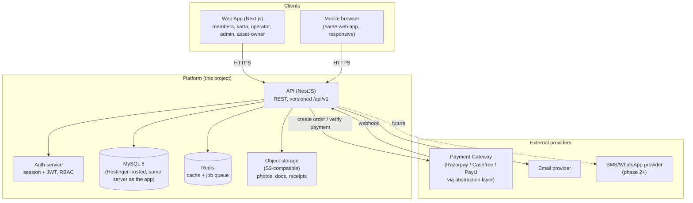

# Phase 1.1 — Product Architecture

## 1. Vision

A trusted digital home for one Indian community (architected to support many communities later) that unifies four things people currently manage across disconnected tools: **who is related to whom** (family registry + tree), **who's available to marry** (matrimony), **what's happening in the community** (social feed), and **how the community organization runs itself financially** (fees, donations, asset bookings, payments).

The system is trust-first: nothing about a person is visible by default beyond what they explicitly allow, every sensitive change is auditable, and money movement is never taken on faith from the browser.

## 2. Design Principles

1. **Community is the tenant boundary.** Every row of community-owned data (families, members, posts, assets, fees) hangs off a `community_id`. Day one ships with exactly one row in `communities`, but no table is designed assuming there's only ever one.
2. **Consent before publication.** A profile field being *filled in* is not the same as it being *visible*. Visibility is a first-class, per-field setting, not an afterthought bolted onto the UI.
3. **Relationships are data, not text.** Family structure is a graph (`member_relationships` edges with typed, invertible relationship types), so the tree is *derived*, never hand-drawn.
4. **Money is server-authoritative.** The browser can request a payment; only a verified webhook or a signed server-side confirmation can mark it paid. Nothing financial is ever deleted — corrections are new ledger entries, not edits.
5. **Nothing sensitive changes silently.** Marital status, death, karta transfer, relationship edits, asset approval, and offline-payment verification all pass through one shared approval engine, not one-off ad hoc checks scattered per feature.
6. **Built for 1M+ members from day one's schema**, even though day one's traffic won't need it — because retrofitting indexing/pagination into a live family-tree query engine is much more painful than designing for it up front.

## 3. System Context

## 4. Module Map

The platform is organized into 22 modules (matching the brief's final module list). Modules share the same auth, privacy, notification, audit, and payment substrate rather than reimplementing them.

| # | Module | Owns |
|---|---|---|
| 1 | Authentication & User Management | users, sessions, roles, permissions |
| 2 | Family Registry | families, family_members, addresses |
| 3 | Family Tree | member_relationships, tree rendering/query |
| 4 | Member Directory | member profile fields, search index |
| 5 | Community Social Network | posts, comments, reactions, reports |
| 6 | Area/Group Management | areas, member_areas, family_areas |
| 7 | Matrimony | matrimonial_profiles, preferences, interests |
| 8 | Community Services | asset_categories, asset facilities/photos |
| 9 | Asset Directory | assets, asset_owners, verification |
| 10 | Online Booking | bookings, booking_items, availability |
| 11 | Online Payment | payment_transactions, gateway abstraction |
| 12 | Community Family Fee Collection | fee_types, fee_rules, fee_invoices |
| 13 | Donations/Contributions | donation_causes, donations |
| 14 | Invoices & Receipts | fee_invoices, booking_invoices, receipts |
| 15 | Financial Ledger | financial_ledger (single source of financial truth) |
| 16 | Refunds & Reconciliation | refunds, payment_reconciliation |
| 17 | Notifications | notifications, notification_preferences |
| 18 | Approval Workflow | approvals, approval_rules |
| 19 | Privacy & Consent | field_visibility_settings, consent_records |
| 20 | Audit Log | audit_logs |
| 21 | Reporting | read-models/views over the above, no new writes |
| 22 | Administration | settings, admin config screens over 1–21 |

## 5. Multi-Community Readiness (day-one scope: single community)

- A `communities` table exists from day one (`id`, `name`, `slug`, `logo_url`, `settings JSON`, timestamps). Day one seeds exactly one row.
- `families`, `posts`, `assets`, `fee_types`, `areas` (top-level), and `users` (community-scoped role grants, not the user identity itself — a person could theoretically belong to more than one community later) all carry `community_id`.
- All list/search queries filter by `community_id` even when there's only one, so the day-two work to open a second community is "insert a row and point a subdomain at it," not "rewrite every query."
- Cross-community sharing (e.g. inter-community matrimony) is explicitly **out of scope** until requested — flagged here so it isn't silently assumed.

## 6. Non-Functional Requirements

| Concern | Target |
|---|---|
| Scale | 10,000 families / 100,000 members now; schema/indexing must not need a redesign at 1M members |
| Availability | Standard web-app SLA; no premature multi-region complexity |
| Response time | Search/list endpoints paginated, p95 < 500ms at target scale |
| Security | OWASP Top 10 mitigations, no plaintext secrets, no card data ever touches our servers |
| Privacy | Field-level visibility enforced at the query layer, not just hidden in the UI |
| Auditability | Every sensitive mutation is reconstructable from `audit_logs` |
| Financial integrity | Every rupee is traceable through `financial_ledger`; nothing financial is hard-deleted |
