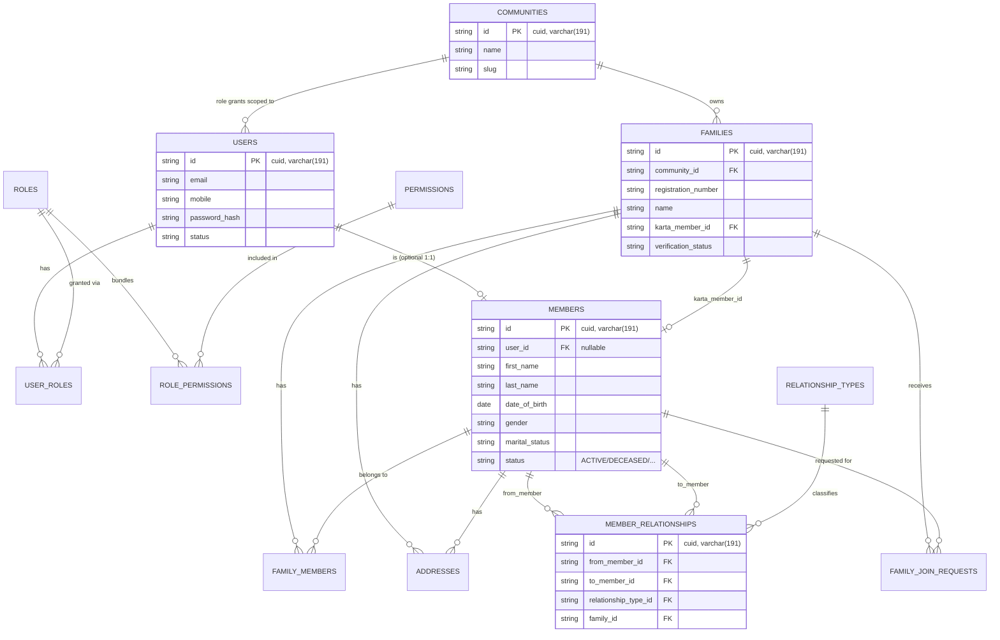
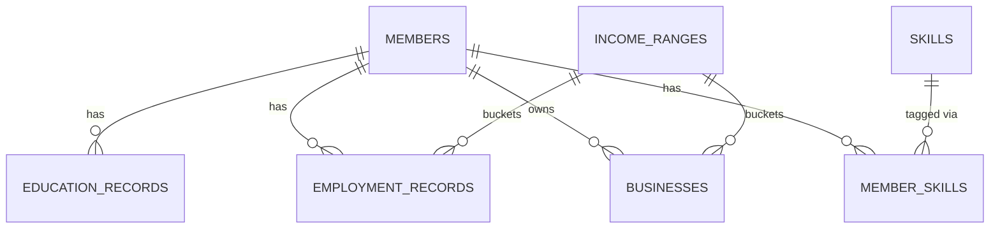
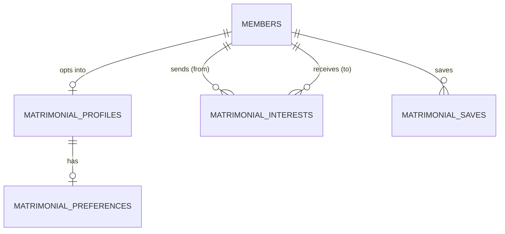
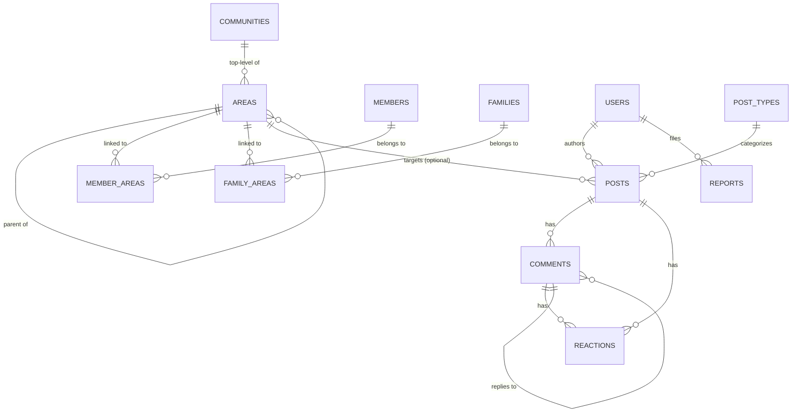
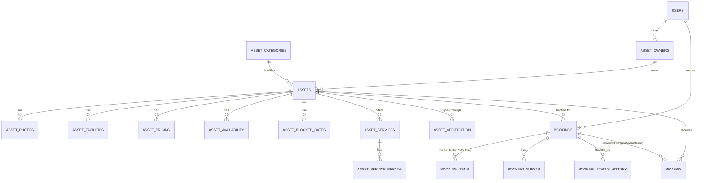
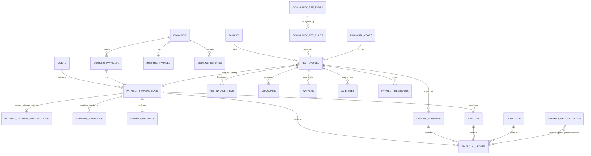
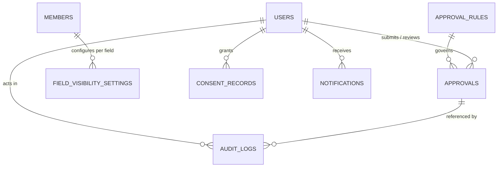

# Phase 1.5 — Database ER Diagrams

Split into domain-focused diagrams rather than one unreadable mega-diagram. Full column lists live in `06-database-schema.md`; these show cardinality and the shape of each domain.

## 5.1 Identity, Family & Tree

## 5.2 Education, Employment, Skills, Income

## 5.3 Matrimony

## 5.4 Community Social Network & Areas

## 5.5 Community Services, Assets & Booking

## 5.6 Payments, Fees & Financial Ledger

## 5.7 Approval, Privacy & Audit (cross-cutting)

