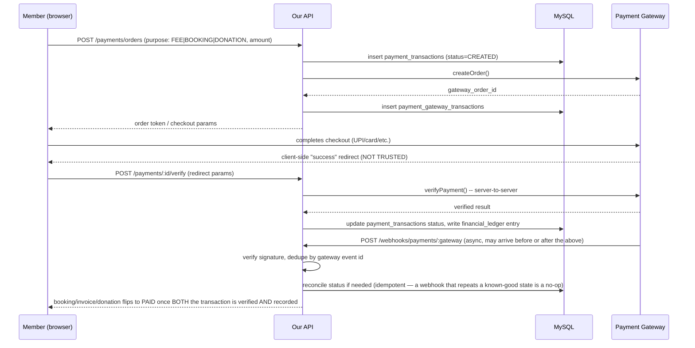

# Phase 1.10 — Payment Architecture

## 1. Gateway Abstraction

```ts
interface PaymentGateway {
  createOrder(input: CreateOrderInput): Promise<GatewayOrder>
  verifyPayment(input: VerifyPaymentInput): Promise<VerificationResult>
  verifyWebhookSignature(rawBody: Buffer, signature: string): boolean
  parseWebhookEvent(rawBody: Buffer): GatewayWebhookEvent
  initiateRefund(input: RefundInput): Promise<GatewayRefund>
}
```

- One implementation per provider (`RazorpayGateway`, `CashfreeGateway`, `PayUGateway`), all behind this interface. The rest of the codebase — booking module, fee module, donation module — only ever talks to `PaymentGateway`, never to a provider SDK directly.
- Active gateway is a community setting (`settings['payment.active_gateway']`), so switching providers doesn't touch business logic — only the factory that resolves which implementation to inject.
- API keys/secrets live in environment/secrets manager, never in the repo, never sent to the frontend. The frontend only ever receives the public/order-scoped token needed to open the gateway's own checkout widget.

## 2. Flow



**The client-side redirect is never sufficient on its own.** A payment is only recorded as successful once our server has independently confirmed it with the gateway — either via the `/verify` call, the webhook, or (as a safety net) a periodic reconciliation job that queries the gateway for any order stuck in `PROCESSING` past a timeout.

## 3. Idempotency & Duplicate Protection

- Every order-creation request carries an `Idempotency-Key`; replaying the same key returns the original transaction instead of creating a second one.
- Webhook events are deduped by `(gateway_code, gateway_event_id)` before being applied — a gateway retry never double-posts to the ledger.
- `financial_ledger` writes happen inside the same DB transaction as the `payment_transactions` status update, so a crash between the two can't leave them inconsistent.

## 4. Payment Status Machine

```
CREATED → PENDING → INITIATED → PROCESSING → SUCCESSFUL
                                            ↘ FAILED
                                            ↘ CANCELLED
SUCCESSFUL → REFUNDED | PARTIALLY_REFUNDED
(any pre-SUCCESSFUL state, on ambiguous gateway response) → UNDER_VERIFICATION → resolved by reconciliation job or manual Admin action
```

## 5. Split/Staged Payments

`booking_payments` (and analogously `fee_invoice_items`) allow a booking/invoice to be satisfied by more than one `payment_transactions` row — e.g. Advance ₹20,000 now, Balance ₹30,000 closer to the event date. The booking/invoice's own "amount paid" is a computed sum over its linked, *successful only*, payment transactions — never a manually-set field that could drift from reality.

## 6. What Is Never Stored

Card numbers, CVV, UPI PIN, net-banking credentials — none of these ever reach our server; they're entered directly into the gateway's own hosted checkout/SDK. We store only: gateway-issued references (order id, payment id), the last 4 digits and network/brand if the gateway's response includes them for receipt display, and the amount/status/timestamps.

## 7. Refunds

- Refund request → Admin (or Asset Owner for a booking they own, subject to the cancellation policy) approves → `RefundsService.initiate()` → gateway refund API → webhook/verify confirms → `financial_ledger` gets an offsetting entry (never edits the original payment's ledger row).
- Partial refunds are modeled as their own `refunds` row with an amount less than the original transaction; multiple partial refunds against one transaction are allowed as long as their sum never exceeds it (enforced by a DB check, not just application logic).
